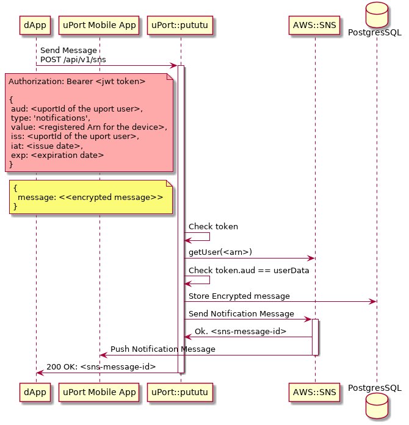
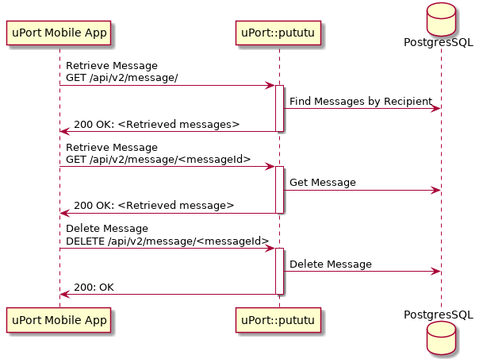

# lambda-pututu
uPort Push Notification Service


[](https://circleci.com/gh/uport-project/lambda-pututu)


[](https://codecov.io/gh/uport-project/lambda-pututu)


## Description
Pututu is a server that allows dApps and servers to send push notification messages to any uPort Mobile App

## API Description
### Push notifications

Pututu can parse and send uport messages to any registered uport mobile app.
The consumer of the API needs to present a "notification token" (JWT) issued
by the uport user.

The format of the payload of the "notification token" is

```
{
 aud: <uportId of the app sending the message>,
 type: 'notifications',
 value: <registered Arn for the device>,
 iss: <uportId of the uport user>,
 iat: <issue date>,
 exp: <expiration date>
}
```

### Endpoint

`POST /sns`

### Headers
```
Authorization: Bearer <jwt token>
```
### Body
```
{
  message: <encrypted message>
}
```

#### Response

| Status |     Message    |                               |
|:------:|----------------|-------------------------------|
| 200    | Ok             | Message Send                   |
| 400    | Fail           | endpointArn not supported     |
| 400    | Fail           | token not signed by endpointArn user |
| 403    | Forbidden      | JWT token missing or invalid  |
| 500    | Internal Error | Internal error                |

#### Response data
```
{
  status: 'success',
  message: <messageId>
}
```
### Sequence Diagram




### Retrieve and delete encrypted messages

Pututu can retrieve and delete encrypted messages stored for the user
The consumer of the API needs to present a "user-auth token" (JWT) issued
by the uport user.

The format of the payload of the "user-auth token" is

```
{
 type: 'user-auth',
 iss: <uportId of the uport user>,
 iat: <issue date>,
 exp: <expiration date>
}
```


### Endpoint

`GET /message`

### Headers
```
Authorization: Bearer <jwt user-auth token>
```

#### Response

| Status |     Message    |                               |
|:------:|----------------|-------------------------------|
| 200    | Ok             | All encrypted messages        |
| 403    | Forbidden      | JWT token missing or invalid  |
| 500    | Internal Error | Internal error                |

#### Response data
```
{
  status: 'success',
  data: <messages>
}
```

### Endpoint

`GET /message/{messageId}`

### Headers
```
Authorization: Bearer <jwt user-auth token>
```

#### Response

| Status |     Message    |                               |
|:------:|----------------|-------------------------------|
| 200    | Ok             | The encrypted messages       |
| 403    | Forbidden      | JWT token missing or invalid  |
| 403    | Forbidden      | Access to message Forbidden   |
| 404    | Not found      | Message not found             |
| 500    | Internal Error | Internal error                |

#### Response data
```
{
  status: 'success',
  data: <message>
}
```

### Endpoint

`DELETE /message/{messageId}`

### Headers
```
Authorization: Bearer <jwt user-auth token>
```

#### Response

| Status |     Message    |                               |
|:------:|----------------|-------------------------------|
| 200    | Ok             | Deleted                       |
| 403    | Forbidden      | JWT token missing or invalid  |
| 403    | Forbidden      | Access to message Forbidden   |
| 404    | Not found      | Message not found             |
| 500    | Internal Error | Internal error                |

#### Response data
```
{
  status: 'success',
  data: 'deleted'
}
```


### Sequence Diagram


